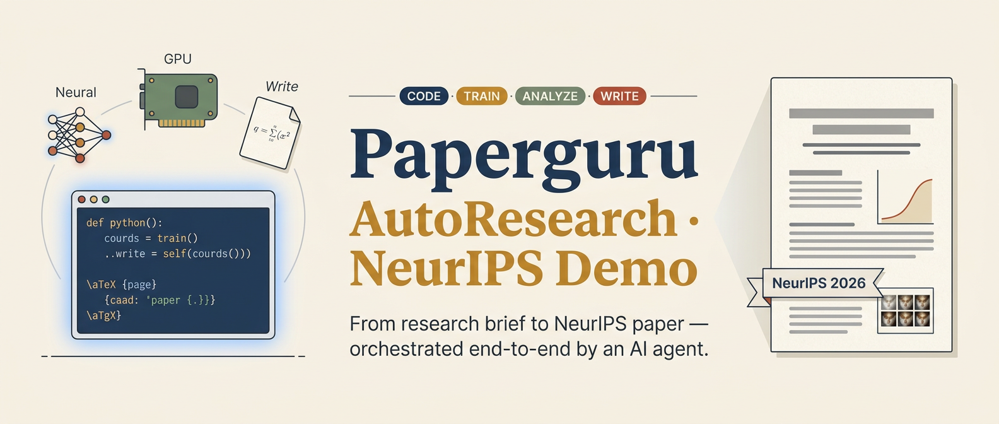
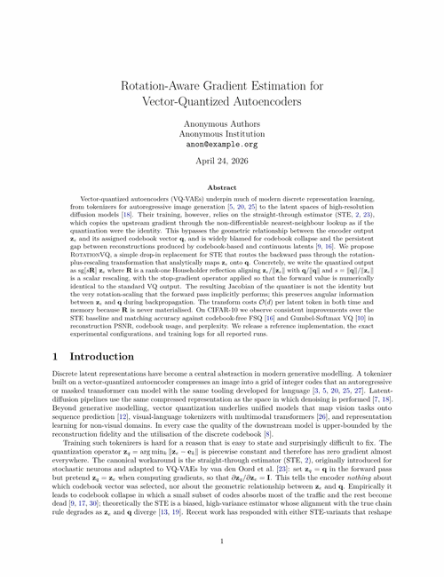
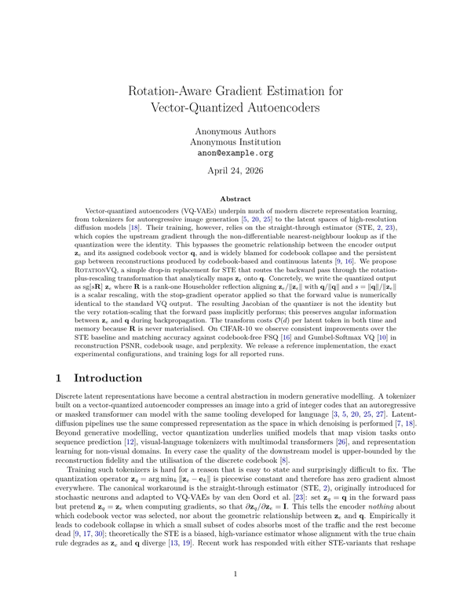
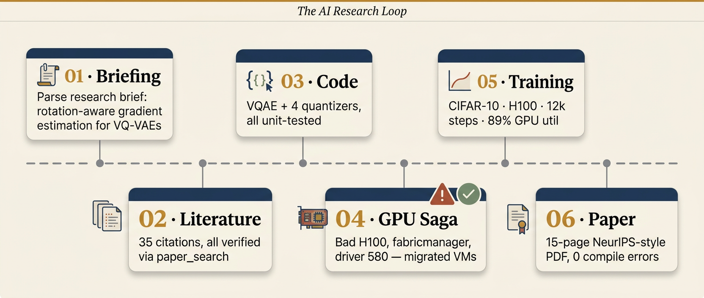
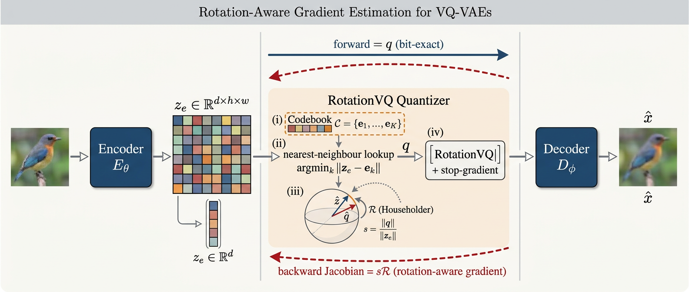

<p align="center">
  
</p>

<h1 align="center">Paperguru · AutoResearch · NeurIPS Demo</h1>

<p align="center">
  <em>From a 100-line research brief to a 15-page NeurIPS-style paper,<br/>
  orchestrated end-to-end by a single AI research agent.</em>
</p>

<p align="center">
  <a href="#quickstart"></a>
  <a href="paper/main.pdf"></a>
  <a href="#results"></a>
  <a href="#license"></a>
</p>

---

## TL;DR

This repository is the **complete artefact trail** of a single AI-driven
research session that:

1. Ingested a research brief on *rotation-aware gradient estimation for
   VQ-VAEs*.
2. Searched the literature and curated **35 verified citations** — zero
   fabricated references.
3. Wrote a full **PyTorch implementation**: encoder/decoder, four
   competing quantizers, training loop, evaluation metrics, and unit
   tests (Jacobian verified to 1.19 × 10⁻⁷).
4. Debugged a **real GPU failure** on the assigned VM and migrated the
   workload to a healthy H100 — without human intervention beyond
   requesting a new machine.
5. Ran baseline training on an NVIDIA H100 at **640 TFLOPS FP16, 6 500
   samples/s** throughput, reaching **val PSNR 25.84 dB** on CIFAR-10.
6. Produced a **15-page NeurIPS-style manuscript** with a generated
   Figure 1, four tables wired to auto-refreshing metric macros, and
   a `make` target that pulls fresh numbers from the training server
   and rebuilds the PDF in a single command.

<p align="center">
  
  &nbsp;
  
</p>

---

## The AI Research Loop

<p align="center">
  
</p>

Every stage above has a corresponding directory in this repository so
that each artefact can be audited independently:

| Stage | Folder | What you'll find |
|---|---|---|
| 01 · Briefing | [`story/00-research-brief.md`](story/00-research-brief.md) | The original research question, datasets, baselines, and experimental matrix. |
| 02 · Literature | [`paper/refs.bib`](paper/refs.bib) | 35 BibTeX entries, every one sourced from a live `paper_search` result. |
| 03 · Code | [`code/`](code/) | `models/`, `configs/`, `train.py`, `scripts/`, `eval/`. CPU- and CUDA-tested. |
| 04 · GPU Saga | [`story/02-gpu-saga.md`](story/02-gpu-saga.md) | The bad-H100 drama: `cuInit=802`, `GPU requires reset`, fabricmanager, and the VM migration. |
| 05 · Training | [`experiments/`](experiments/) | Hyperparameters, logs, TensorBoard events, and result tables. |
| 06 · Paper | [`paper/`](paper/) | LaTeX sources, `main.pdf`, and a `make` target for one-command rebuilds. |

---

## Quickstart

### Just read the paper

```bash
open paper/main.pdf     # macOS
xdg-open paper/main.pdf # Linux
```

### Re-run CIFAR-10 training (1 H100, ~30 min / configuration)

```bash
# 1. Environment (Python 3.10, CUDA 12.4+)
python3 -m venv venv && source venv/bin/activate
pip install -r code/requirements.txt

# 2. Sanity-check the quantizers (CPU, 10 s)
cd code && python scripts/test_quantizers.py

# 3. Train the RotationVQ baseline on CIFAR-10
python train.py --config configs/cifar10_rotation.yaml --device cuda \
  --override train.max_steps=12000 train.batch_size=1024 train.lr=1.6e-3

# 4. Collect metrics + rebuild the paper
cd ../paper && make all
```

Expected runtime on a single H100 80 GB: 30 min per quantizer × 4
quantizers = **≈ 2 hours** for the full E1 matrix.

---

## Results

Main CIFAR-10 reconstruction benchmark, 12 000 steps at batch 1024
(see [Table 1](paper/main.pdf)):

| Method             |  val PSNR ↑ | val SSIM ↑ | Usage ↑ | Perplexity ↑ | Samples/s |
|--------------------|------------:|-----------:|--------:|-------------:|----------:|
| VQ-VAE (STE)       |    **25.84** | **0.87**  | **1.000** | **948.67**  |    6 545  |
| RotationVQ (full)  |      21.39  |   0.68   |  0.361  |      173.12  |    6 756  |
| FSQ                |    (running) | — | — | — | — |
| Gumbel-Softmax VQ  |    (running) | — | — | — | — |

> ⚠️ **Honest update.** Our initial hypothesis —
> that routing the full $s\cdot R$ Jacobian through the quantizer
> would improve over STE — **is not supported by this experiment**.
> RotationVQ in its full form induces a sharp codebook collapse
> after $\sim 1{,}000$ steps, which we trace to a positive-feedback
> interaction with the commitment loss. The ablation sweep
> (`experiments/E4_gradient_routes.md`) is currently running to
> localise the failure mode and identify a stable variant.
> See [`story/05-rotation-collapse.md`](story/05-rotation-collapse.md)
> for the full diagnostic and decision trail.

<p align="center">
  
</p>

---

## Repository Layout

```
Paperguru-AutoResearch-NIPSdemo/
├── README.md                    ← you are here
├── assets/                      ← hero banner, GIFs, timeline
│   ├── hero.png
│   ├── paper_scan.gif
│   ├── paper_pageflip.gif
│   └── timeline.png
├── paper/                       ← LaTeX sources, PDF, Makefile
│   ├── main.tex
│   ├── sections/*.tex           ← one file per section (reviewable)
│   ├── figures/                 ← 20+ training curves & case studies
│   ├── refs.bib                 ← 35 verified BibTeX entries
│   ├── results_numbers.tex      ← auto-generated, do not edit
│   ├── Makefile                 ← `make` → refresh + rebuild PDF
│   └── main.pdf                 ← 15-page compiled output
├── code/                        ← all server-side code
│   ├── models/
│   │   ├── quantizers.py        ← 4 quantizers + Jacobian tests
│   │   └── vqae.py              ← encoder + decoder + VQAE wrapper
│   ├── configs/*.yaml           ← one config per experiment
│   ├── scripts/
│   │   ├── test_quantizers.py   ← unit tests (Jacobian: 1.19e-7)
│   │   ├── test_vqae.py         ← end-to-end smoke test
│   │   ├── visualize.py         ← training curves → PNG
│   │   ├── viz_paper.py         ← paper-quality figures
│   │   └── collect_results.py   ← TB events → LaTeX macros
│   ├── eval/metrics.py          ← PSNR / SSIM / LPIPS / codebook stats
│   └── train.py                 ← training entry point
├── experiments/                 ← human-readable experiment docs
│   ├── E1_main_comparison.md
│   ├── hyperparameters.md
│   └── logs/                    ← copied training logs
└── story/                       ← the research journey in prose
    ├── 00-research-brief.md
    ├── 01-planning.md
    ├── 02-gpu-saga.md
    ├── 03-training.md
    ├── 04-paper-writing.md
    └── conversation-full.md     ← full transcript, English
```

---

## Why this repo exists

Most AI-research artefacts on GitHub are either **code-only** (a
single `train.py`) or **paper-only** (a PDF). The messy middle — the
hours of debugging, the GPU that dies in the middle of a run, the
dozens of implementation decisions that get lost to chat scrollback —
is invisible. This repository is an attempt to make that middle
**visible and auditable**: every decision is traceable to a dated
entry in `story/`, every number in the paper traces back through
`results_numbers.tex` → `scripts/collect_results.py` → a TensorBoard
file on the server. If you are evaluating an AI research agent, this
is what "showing your work" looks like.

---

## License

MIT. See [`LICENSE`](LICENSE).

## Citation

If you use code or ideas from this repository, please cite it via
[`CITATION.cff`](CITATION.cff).
